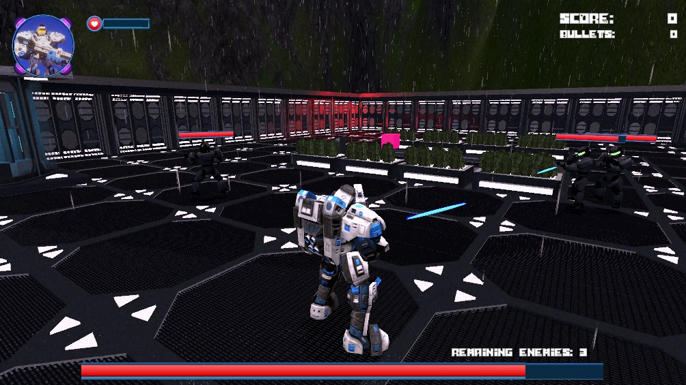

# SpatialShooter

Game project made in unity following to learn and practice the nexts feature:
- Understanding URP/HDRP pipelines
- Terrain generation
- Materials and Shader Graphs
- Particles systems (Standard and VFX Graph)
- Illumination (Types and generation using Realtime and Baking)
- Postprocess effects
- GUI implementation and managing
- Animator Controller (Using animations created by artists)
- Scripting (Game controller, Managers, Singletons, AI, UnityEvents, etc) implementing some optimizations like Object pooling.
- Physics
- Scene Manager
- NavMeshNavigation
- Cinemachine

## Screenshot

  

